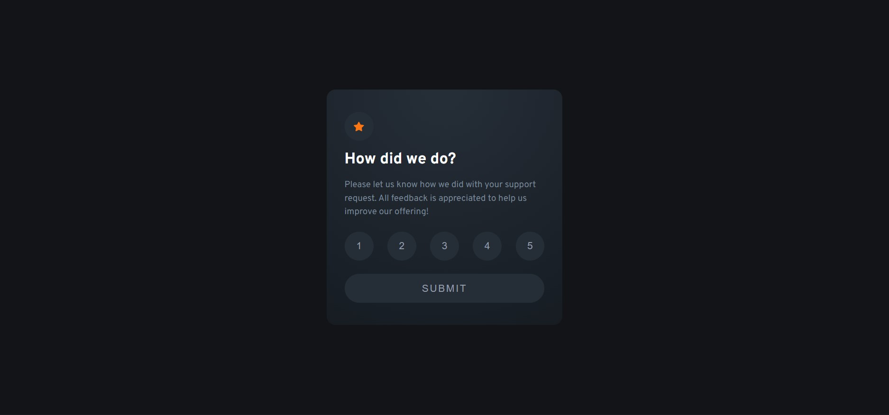

# Frontend Mentor - Interactive rating component solution

This is a solution to the [Interactive rating component challenge on Frontend Mentor](https://www.frontendmentor.io/challenges/interactive-rating-component-koxpeBUmI). Frontend Mentor challenges help you improve your coding skills by building realistic projects. 

## Table of contents

- [Overview](#overview)
  - [The challenge](#the-challenge)
  - [Screenshot](#screenshot)
  - [Links](#links)
  - [Built with](#built-with)
- [Author](#author)

## Overview

### The challenge

Users should be able to:

- View the optimal layout for the app depending on their device's screen size
- See hover states for all interactive elements on the page
- Select and submit a number rating
- See the "Thank you" card state after submitting a rating

### Screenshot

### Links

- Solution URL: [https://github.com/Pasek108/FM-InteractiveRatingComponent/](https://github.com/Pasek108/FM-InteractiveRatingComponent/)
- Live Site URL: [https://pasek108.github.io/FM-InteractiveRatingComponent/](https://pasek108.github.io/FM-InteractiveRatingComponent/)

## My process

### Built with

- HTML 5
- SCSS
- Angular

## Author

- Website - [Artur Pas](https://pas-artur.000webhostapp.com)
- Frontend Mentor - [@Pasek108](https://www.frontendmentor.io/profile/Pasek108)
